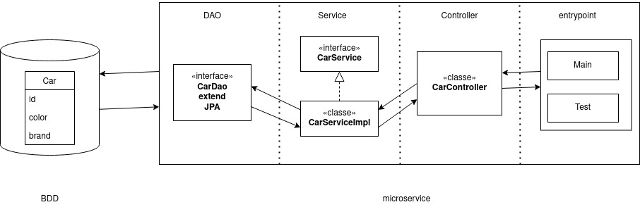
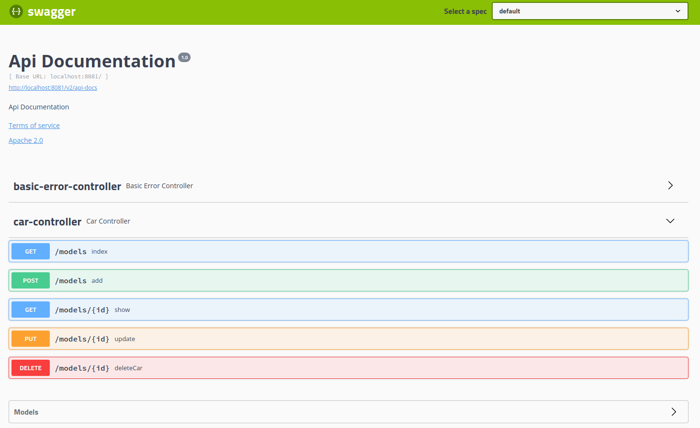

# java-springboot-microservice-CarList

### Schema Application:

### API Documentation

### Annotation definition

* **@SpringBootApplication** : enables Spring Boot autoconfiguration and component scanning
* **@Autowired** : marks a constructor, field, or setter method to be autowired by Spring dependency injection.
* **@RestController** :  marks the class as web controller, capable of handling the requests.
* **@GetMapping** , **@PostMapping**, **@PutMapping**, **DeleteMapping** : maps HTTP requests with a path to a controller method.
* **@PathVariable** :  Indicate that variable is in uri.
* **@RequestBody** : Indicate that variable is in request body.
* **@Service** : indicates that an annotated class is a service class.
* **@Repository** : indicates that an annotated class is a repository, which is an abstraction of data access and storage.
* **@Entity** : mark the class as JPA entity, is mapped to a table named identically.
* **@JsonIgnore** : indicates that the annotated method or field is to be ignored by introspection-based serialization and deserialization functionality.  
* **@Id** : marks a field as a primary key field, it is automatically injected into that field by ObjectDB.
* **@GeneratedValue** : specifies that the primary key is automatically allocated by ObjectDB.
* **@Override** : Indicate that methode is inherited.